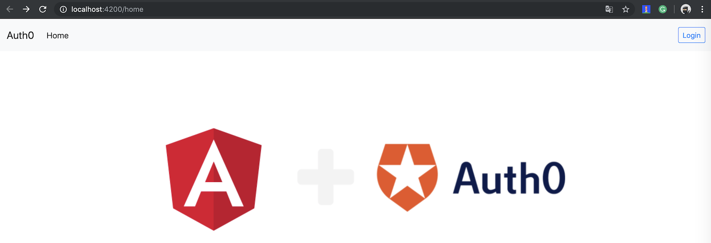
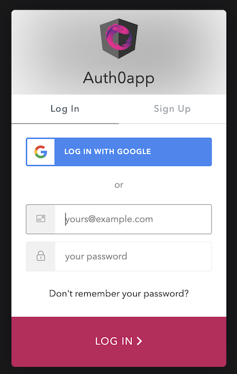
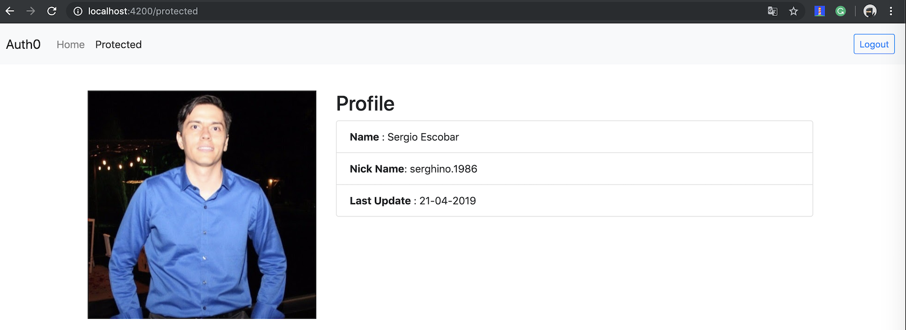

#Auth0 to Angular V7

> This App `Auth0app`, connect Angular with Auth0, using one page public and other private.

> If you want check differents options to make your *universal login* more useful go to this link: 
[Auth0 libraries](https://auth0.com/docs/libraries/lock/v11#introduction)

> **Home** :   

> **Auth Custom Login** :   

> **Private Page** :   

